#NATIONAL ASSEMBLY BUILDING of BANGLADESH
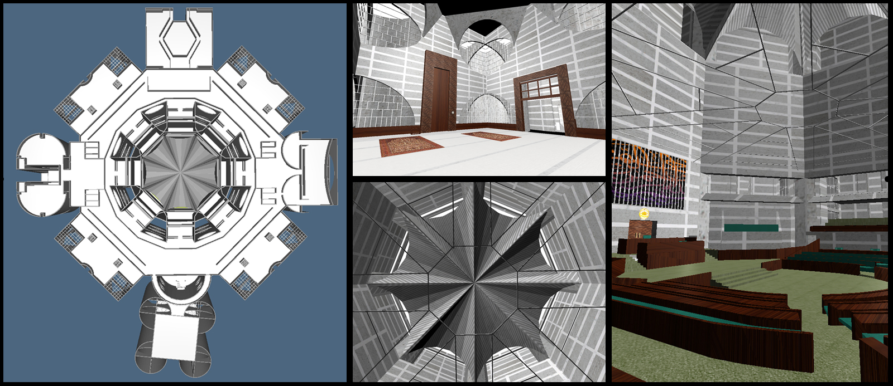
---
#Contents
1. [Model LAR](#1model-lar)
  1. [Minister's lounge](#ministers-lounge)
  2. [Office](#office)
  3. [Prayer hall](#prayer-hall)
  4. [Dinning and recreation](#dinning-and-recreation)
  5. [Entrance hall](#entrance-hall)
  6. [Central area](#central-area)
2. [Complete](#2complete)
3. [Texture & Furniture](#3texture--furniture)

***
#1.Model LAR
This project consists in reproducing graphically the house of the Parliament of Bangladesh: **National Assembly Building**, designed by **Louis Kahn**. 

The architect’s key design philosophy was to represent Bangladeshi culture and heritage, while at the same time optimizing the use of space. The exterior of the building is striking in its simplicity, with huge walls and large openings of regular geometric shapes.

The building consists of nine individual blocks that I have recreated separately.
##Minister's lounge

This is the building that houses residences for the members of the Parliament. It is located on the west side.

To model this structure I designed the skeleton of plan.

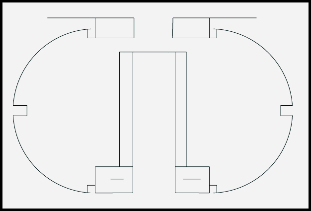

I extruded the walls from the plant and added details like stairs, windows and floors.

 

##Office
This is the building of the offices. It is repeated 4 times around the centrale area.

 

The plan is simply and the sides have holes of geometric shapes: triangles, rectangles and circles.

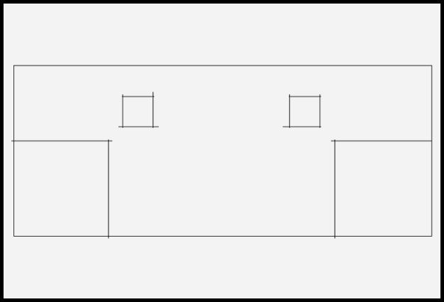 
 
##Prayer hall
For this building I have not used the design of the floor plan, but I created the cylindrical columns and the curved walls with specific functions.

 

Then I created the holes for windows and doors, and added grates, floors and other details.

 

##Dinning and recreation
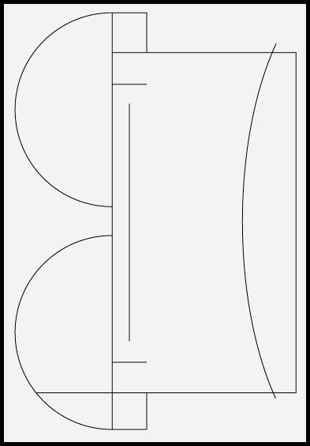 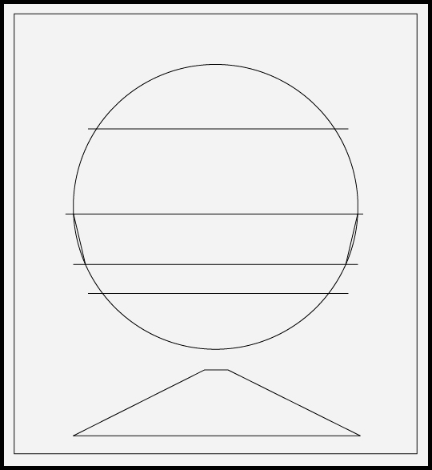
 
##Entrance hall
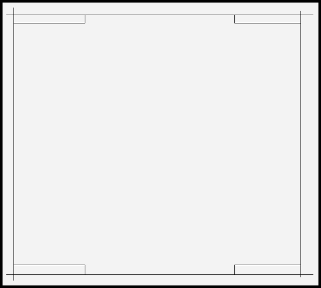
 
##Central area
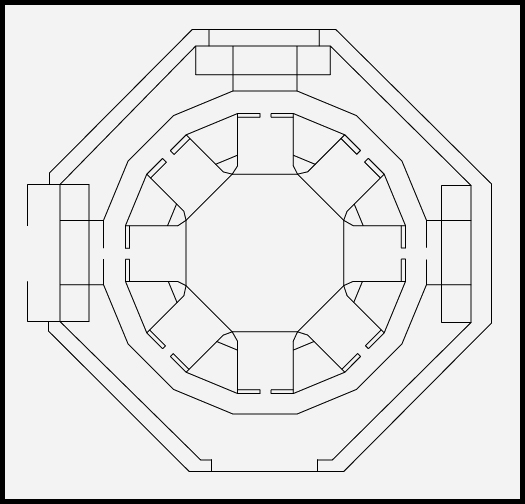 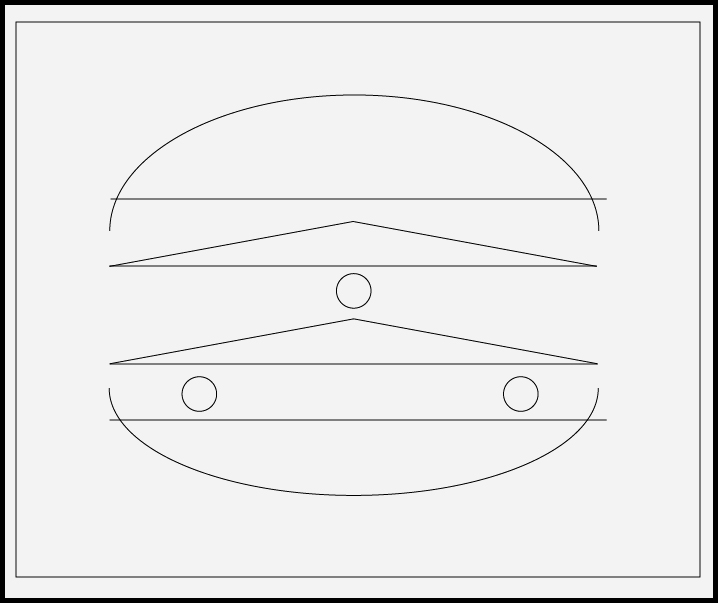 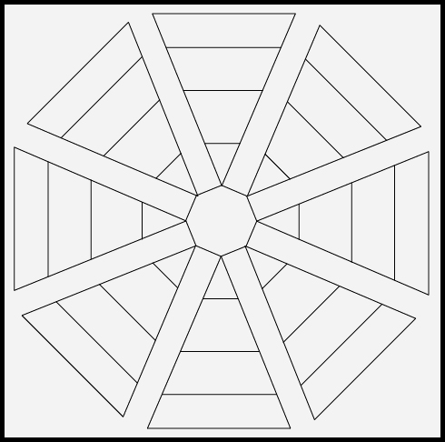
        
 

***
#2.Complete

***
#3.Texture & Furniture
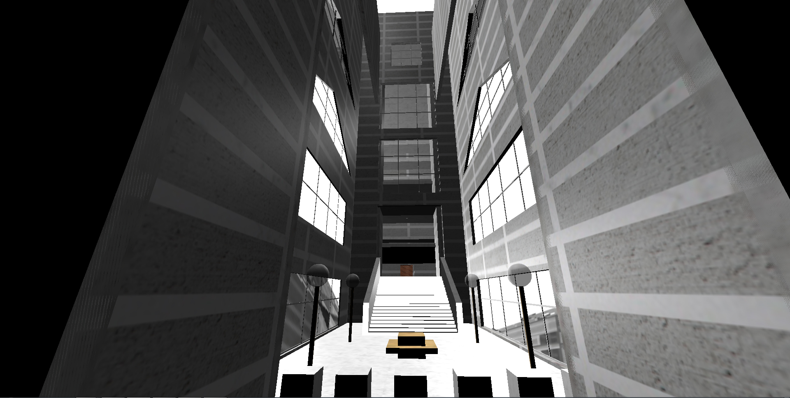

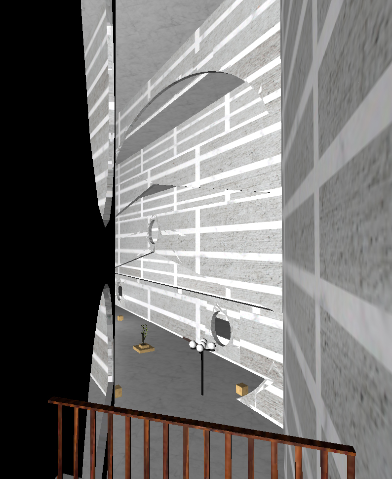
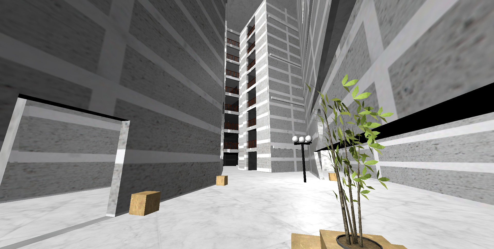

