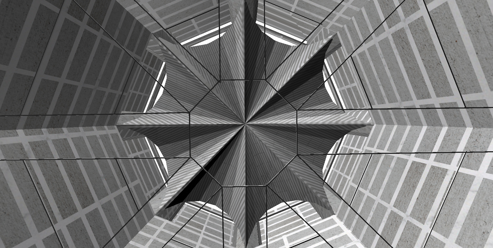

#NATIONAL ASSEMBLY BUILDING of BANGLADESH

---
#Contents
1. [Model LAR](#1model-lar)
  1. [Minister's lounge](#ministers-lounge)
  2. [Office](#office)
  3. [Prayer hall](#prayer-hall)
  4. [Dinning and recreation](#dinning-and-recreation)
  5. [Entrance hall](#entrance-hall)
  6. [Central area](#central-area)
2. [Complete](#2complete)
3. [Texture & Furniture](#3texture--furniture)

___
#1.Model LAR
##Minister's lounge

 
##Office
   
  
##Prayer hall
 
##Dinning and recreation
 
 
##Entrance hall

 
##Central area
  
        
 
___
#2.Complete

___
#3.Texture & Furniture

